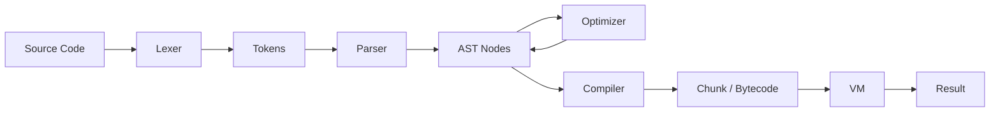

# CVM++: A High-Performance Stack-Based Virtual Machine

CVM++ is a feature-rich, high-performance stack-based virtual machine and compiler toolchain written in modern C++ (C++17). It serves as both an educational resource for understanding language implementation and a robust foundation for building domain-specific languages.

## 🚀 Key Features

- **Lexical Analysis:** Efficient tokenization with support for numbers, strings, identifiers, and keywords.
- **Recursive Descent Parser:** A clean, easy-to-extend parser that builds an Abstract Syntax Tree (AST).
- **AST Constant Folding:** Static optimization phase to reduce constant expressions at compile-time.
- **Bytecode Compiler:** Translates high-level AST nodes into a compact, optimized bytecode format.
- **Optimized VM:** A stack-based execution engine featuring:
  - **Computed Gotos:** Efficient instruction dispatch (on GCC/Clang).
  - **Call Frames:** Native support for function calls and recursion.
  - **Lexical Scoping:** Proper handling of local variables and shadowed declarations.
- **Robust Error System:** Detailed error reporting with line numbers and descriptive messages for all phases (Lexing, Parsing, Compiling, Runtime).
- **Interactive REPL:** Immediate feedback loop for testing code snippets.

## 🏗 Architecture

The CVM++ pipeline follows the classic compiler design:

1.  **Lexer (`src/lexer.cpp`)**: Converts source text into a stream of `Token` objects.
2.  **Parser (`src/parser.cpp`)**: Consumes tokens to produce a `Program` structure consisting of `Stmt` (Statement) and `Expr` (Expression) nodes.
3.  **Optimizer (`src/ast.cpp`)**: Performs a pass over the AST to fold constant expressions (e.g., `2 + 3` becomes `5`).
4.  **Compiler (`src/compiler.cpp`)**: Traverses the AST to emit `OpCode` instructions into a `Chunk`.
5.  **VM (`src/vm.cpp`)**: Executes the `Chunk` using a high-speed dispatch loop.



## 🛠 Instruction Set Architecture (ISA)

CVM++ uses a custom bytecode format. Each instruction consists of a 1-byte opcode followed by optional operands.

| Opcode | Operands | Description |
| :--- | :--- | :--- |
| `PUSH_CONST` | `idx:u16` | Pushes a constant from the pool onto the stack. |
| `PUSH_TRUE` | - | Pushes boolean `true`. |
| `PUSH_FALSE` | - | Pushes boolean `false`. |
| `ADD`, `SUB`, `MUL`, `DIV` | - | Standard arithmetic operations. |
| `NEG`, `NOT` | - | Unary negation and logical NOT. |
| `EQ`, `NEQ`, `LT`, `GT`, ... | - | Comparison operators. |
| `DEFINE_GLOBAL` | `idx:u16` | Defines a global variable. |
| `GET_GLOBAL` | `idx:u16` | Retrieves a global variable by name index. |
| `SET_GLOBAL` | `idx:u16` | Updates an existing global variable. |
| `GET_LOCAL` | `slot:u16` | Retrieves a local variable from the current stack frame. |
| `SET_LOCAL` | `slot:u16` | Updates a local variable in the current stack frame. |
| `JUMP`, `LOOP` | `off:u16` | Unconditional control flow. |
| `JUMP_IF_FALSE` | `off:u16` | Conditional control flow. |
| `CALL` | `argc:u8` | Invokes a function with N arguments. |
| `RET` | - | Returns from the current function. |
| `PRINT` | - | Pops and prints the top value. |
| `INPUT` | - | Reads a line from stdin and pushes it (as int or string). |
| `HALT` | - | Terminates execution. |

## 📝 Language Specification

### Data Types
- **Integer:** 64-bit signed integers (`int64_t`).
- **Boolean:** `true` and `false`.
- **String:** UTF-8 encoded strings.
- **Function:** First-class objects (can be passed as values).

### Syntax Examples

#### Variables and Scoping
```cvm
let x = 10
{
    let y = 20
    print x + y // 30
}
// y is out of scope here
```

#### Functions and Recursion
```cvm
fn fib(n) {
    if n < 2 { return n }
    return fib(n - 1) + fib(n - 2)
}
print fib(10) // 55
```

#### Loops and Control Flow
```cvm
let i = 0
while i < 5 {
    print "Iteration: " + i
    i = i + 1
}
```

## ⚙️ Getting Started

### Prerequisites
- C++17 compatible compiler (GCC 9+, Clang 10+, or MSVC 2019+)
- CMake 3.16 or higher

### Build Instructions
```bash
# Clone the repository
git clone https://github.com/yourusername/cvmplusplus.git
cd cvmplusplus

# Create build directory
mkdir build && cd build

# Configure and build
cmake ..
make -j$(nproc)
```

### Usage
Run a script:
```bash
./cvm path/to/script.cvm
```

Launch the REPL:
```bash
./cvm
```

Debug modes:
```bash
./cvm --dump-tokens script.cvm    # Show token stream
./cvm --dump-ast script.cvm       # Show AST structure
./cvm --dump-bytecode script.cvm  # Show disassembled bytecode
```

## 🔍 Developer Guide

### Project Structure
- `include/cvm/`: Header files defining the core interfaces.
- `src/`: Implementation files.
- `scripts/`: Example scripts and test cases.
- `tests/`: Unit and integration tests (GTest based).

### Adding New Opcodes
1.  Add the opcode to `enum class OpCode` in `include/cvm/chunk.hpp`.
2.  Implement the logic in the `DISPATCH()` loop in `src/vm.cpp`.
3.  Update the `disassembleInstruction` function in `src/debug.cpp`.
4.  Add a corresponding AST node and compiler logic if the opcode is used by the language.

## 📈 Optimizations

CVM++ employs several performance-enhancing techniques:
- **Computed Gotos:** On supported compilers, the VM uses a dispatch table of labels, avoiding the overhead of a massive `switch` statement and improving branch prediction.
- **Stack-based Execution:** Minimizes memory allocations during runtime by using a pre-allocated stack for temporary values and local variables.
- **Constant Folding:** Expressions involving literals (e.g., `10 * 20`) are evaluated at compile-time, reducing the number of instructions executed.
- **String Interning (Planned):** Future versions will include string interning to speed up comparisons and reduce memory usage.

